# 🍬 Marshmallow Land

> **낮에는 마을을 키우고, 밤에는 몰려오는 적을 막아내세요.**

과자와 디저트로 이루어진 세계에서 마을을 발전시키고 본진을 지키는 **타워 디펜스·마을 경영 전략 게임**입니다. 주민을 배치해 자원을 확보하고, 타워를 배치·합성해 방어선을 구축하며, 스킬과 웨이브 보상으로 자신만의 전략을 만들어갑니다.

<!-- 미디어는 Docs/Media/Readme/에 저장한 뒤 해당 이미지 줄의 주석을 해제하세요. 실제 파일명에 맞춰 경로를 수정해도 됩니다. -->
<!--  -->

| 항목 | 내용 |
| --- | --- |
| 장르 | 타워 디펜스 · 마을 경영 · 전략 |
| 개발 기간 | 2026.07.08 ~ 2026.09.03 |
| 팀 구성 | 4인 팀 프로젝트 |
| 개발 환경 | Unity 6.3 (URP), C# |

## 01. 게임 소개

### 기획 의도

**낮의 마을 경영이 밤의 방어로 이어지는 게임**입니다. 낮에는 주민을 배치해 자원 생산량을 조절하고, 건물을 업그레이드하거나 타워를 배치·합성해 전투를 준비합니다. 밤에는 준비한 방어선과 직접 사용하는 스킬로 몰려오는 몬스터를 막아냅니다.

한정된 자원을 생산 시설에 투자할지, 당장의 방어에 사용할지 판단해야 합니다. 타워의 위치와 합성을 고민하고, 웨이브 보상으로 스킬을 강화하며 다음 전투를 준비합니다.

- **성장과 방어의 균형** — 마을 발전과 방어선 강화 사이에서 자원 투자의 우선순위를 정합니다.
- **배치와 합성의 전략** — 적의 이동 경로와 타워의 특성을 고려해 방어선을 구축합니다.
- **보상으로 이어지는 성장** — 웨이브 보상을 선택해 스킬을 강화하고 다음 전투에 대비합니다.

### 게임 루프

**낮의 준비 → 밤의 전투 → 웨이브 클리어 및 보상 → 다음 날의 정비**

<!--  -->

| 단계 | 플레이 |
| --- | --- |
| 낮 · 준비 | 생산 건물에 주민을 배치하고, 자원으로 건물을 업그레이드하거나 타워를 배치·합성합니다. |
| 밤 · 전투 | 타워의 자동 공격과 플레이어의 스킬로 몰려오는 몬스터를 막아냅니다. |
| 웨이브 클리어 · 보상 | 특정 웨이브를 클리어하면 보상을 선택해 스킬을 강화합니다. |
| 다음 날 · 정비 | 배치한 주민에 따라 정산된 자원으로 마을과 방어선을 정비합니다. |

이 과정을 반복하며 **본진을 지키고, 보스전을 포함한 총 20웨이브를 클리어하는 것**이 목표입니다.

### 조작법

| 조작 | 기능 |
| --- | --- |
| `W` `A` `S` `D` | 카메라 이동 |
| 마우스 우클릭 드래그 | 카메라 이동 |
| 마우스 휠 | 화면 확대 / 축소 |
| 마우스 클릭 | UI 및 상호작용 |
| `Q` | 스킬 사용 |
| `Ctrl` + `Z` | 이전 행동 되돌리기 |
| `Space` | 게임 속도 변경 |
| `1` ~ `7` | 주요 건물 바로가기 |

## 02. 주요 게임 기능

### 주민 배치 및 자원 정산

<!-- 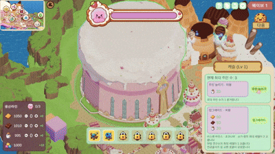 -->

- 생산 건물에 주민을 배치해 자원 생산량을 조절합니다.
- 생산 라인 패널에서 자원별 생산량을 확인하고, 다음 날 정산에 대비합니다.
- 필요한 자원에 맞춰 주민을 다른 생산 건물로 재배치할 수 있습니다.

<!-- 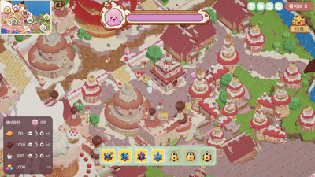 -->

### 건물 업그레이드

<!-- 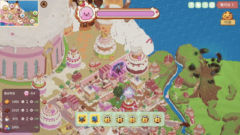 -->

- 자원을 소모해 생산 시설, 마법연구소, 캐슬 등을 업그레이드합니다.
- 건물 종류에 따라 서로 다른 강화 효과가 적용됩니다.
- 건물 정보 패널에서 업그레이드 비용과 효과를 확인할 수 있습니다.

### 자원 교환

<!-- 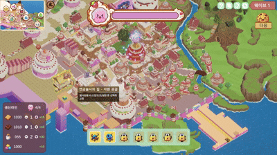 -->

- 연금술사의 집에서 **별사탕을 비스켓·초코·설탕으로 교환**할 수 있습니다.
- 필요한 자원을 확보해 건물 성장과 방어 준비에 활용합니다.

### 전투맵 및 버프타일

<!-- 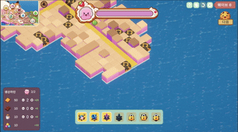 -->

- 웨이브가 진행되면서 전투맵이 조금씩 확장되고, 새로운 경로와 타워 배치 공간이 나타납니다.
- 전투맵 확장과 함께 버프타일이 등장합니다.
- 버프타일 위에 타워를 배치하면 해당 타일의 강화 효과를 받을 수 있습니다.

### 타워 배치

<!-- 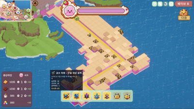 -->

- 자원을 소모해 전투맵의 배치 가능한 타일에 타워를 설치합니다.
- 몬스터의 이동 경로와 타워의 공격 범위를 고려해 배치 위치를 선택합니다.
- 배치한 타워는 밤에 사거리 안의 몬스터를 자동으로 공격합니다.

### 타워 합성

<!-- 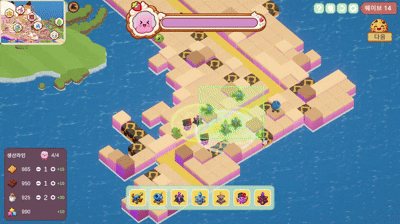 -->

- 여러 타워를 선택하면 합성 가능한 상위 타워 목록이 표시됩니다.
- 합성 후보에 마우스를 올려 재료로 소모되는 타워를 미리 확인할 수 있습니다.
- 합성을 실행하면 필요한 재료 타워를 소모해 상위 타워를 제작합니다.

### 몬스터 웨이브 및 보스

<!-- 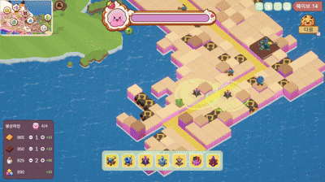 -->

- 밤이 되면 몬스터가 등장해 경로를 따라 본진으로 이동합니다.
- 타워의 자동 공격과 스킬을 활용해 몬스터를 막고 본진을 보호해야 합니다.

<!-- 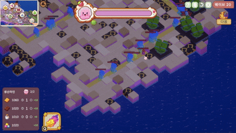 -->

- 마지막 **20웨이브**에는 고유한 능력을 가진 보스가 등장합니다.
- 보스의 능력에 대응하며 타워와 스킬로 공략해야 합니다.

### 스킬 사용 및 강화

<!-- 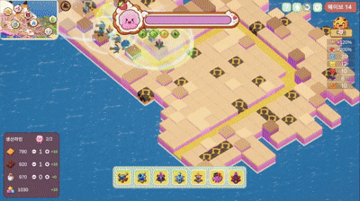 -->

- 전투 중 스킬을 직접 사용해 몬스터를 공격하거나 방어를 지원합니다.
- 사용한 스킬은 재사용 대기시간이 지나면 다시 사용할 수 있습니다.

<!-- 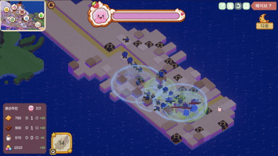 -->

- 특정 웨이브를 클리어하면 보상 선택 패널이 나타납니다.
- 제시된 보상 중 원하는 강화 효과를 선택해 스킬을 강화합니다.
